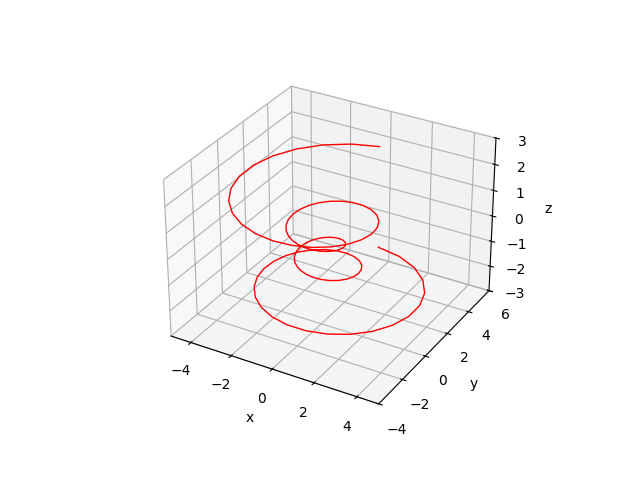

# Исправленная версия matplotlib-cpp

Библиотека matplotlib-cpp представляет собой реализацию на языке C++ удобного и широко распространённого подхода к построению графиков. Преимущественно она использует средства, используемые в matplotlib - пожалуй, одном из наиболее популярных инструменте API для построения графиков.

Оригинальная версия библиотеки представляет широкий спектр для представления данных в виде различных типов графиков. Однако многие из реализуемых в библиотеке методов могут создавать ряд несовместимостей, связанных с ОС или IDE, которые использует пользователь, и поэтому требуют дополнительной настройки. Особенно детальной настройки требуют 3D графики, на которые данная библиотека ориентирована гораздо меньше, нежели на другие типы графиков.

В данном репозитории представлена дополненная версия matplotlib-cpp, содержащая новые функции построения графиков, которые значительно упрощают процесс и позволяют осуществлять пользователю больший контроль за ним. Представляемая версия также содержит ряд исправлений, устраняющих вышеупомянутые несовместимости. Эта версия устраняет все неудобства, касающихся построения 3D графиков, а также добавляет ряд привычных функций, необходимых при работе с ними, но которые не были добавлены в оригинальной библиотеке. Новые функции повторяют синтаксис аналогичных функций из matplotlib для Python.

## Предварительные замечания

Предлагаемая нами версия matplotlib-cpp, реализуемая в заголовочном файле "matplotlibcpp.h", при правильной настройке этого файла в проекте программы, лишена несовместимостей с IDE **Visual Studio**, работающей на ОС **Windows**. Поэтому для успешного использования библиотеки рекоменудется использовать именно эти среду разработки и ОС. Для них же приведена краткая инструкция настройки библиотеки (см. ниже).

Помимо этого, гарантированная работа библиотеки при вышеперечисленных условиях подразумевает также использование версии **Python 3.9**, а не выше. Её можно скачать с официального сайта разработчика. Использование более новых версий Python может привести к ряду трудностей. Например, мы столкнулись с проблемой подключения Python 3.13, но эта проблема была устранена при понижении версии Python до 3.9. Однако использование новых версий так же может оказаться успешной.

## Инструкция

1) Скачайте заголовочный файл "matplotlibcpp.h", расположенный в папке "MyLib" данного репозиторий. Привяжите его к вашему проекту стандартным образом.
2) Выберите конфигурацию сборки Release для вашего проекта.
3) Откройте свойства проекта, затем: "Свойства конфигурации -> Каталоги VC++ -> Общие -> Включаемые каталоги". необходимо выбрать два пути к каталогам Python 3.9 на вашем компьюьтере. Наши пути выглядят так:
    - `"C:\Users\user\AppData\Local\Programs\Python\Python39\Lib\site-packages\numpy\_core\include"` (подключает numpy);
    - `"C:\Users\user\AppData\Local\Programs\Python\Python39\include" (остальные подключения).` \
Вид ваших путей зависит от папки, куда был установлен Python 3.9.
4) Затем в тех же настройках выберите "Каталоги библиотек" и выберете путь к оставшимся используемым библиотекам Python. Наш путь выглядит так:
    - `"C:\Users\user\AppData\Local\Programs\Python\Python39\libs"`.

На этом настройка библиотеки matplotlib-cpp для Visual Studio завершается. Все включаемые пути в заголовочном файле "matplotlibcpp.h" должны корректно отображаться. Теперь библиотека может быть использована в проекте.

## Основные добавленные функции

В нашем заголовочном файле были добавлены новые функции для отображения графиков, а также сохранены старые. В вашей программе вы можете использовать как те, так и другие функции. Однако, например, для отображения 3D графиков крайне рекомендуется использовать именно новые, добавленные нами функции. К тому же, старые функции могут не работать в вашей программе (как это было у нас), тогда как новые обеспечивают исправную работу. Новые функции, основанные на других методах, автономны и полностью заменяют старые. 

Кроме того, использование нами добавленных функций сохраняет единообразие программы и устраняет неисправности между разными (новыми и старыми) функциями построения графиков. Поэтому если вы начали использовать их в своём проекте (например, для построения 3D графиков), то для последующих графиков (например, обычных 2D) рекомендуется тоже использовать новые функции.

Ниже представлена сводка основных (наиболее употребимых) добавленных функций (для 3D графиков):

- `chart(int i)` \
Создаёт объект, содержащий графическое поле.

Именно на этом поле размещаются оси, а также дальнейшие отображаемые пользователем данные. Этот метод необходимо вызывать перед построеним новых графиков, которые должны располагаться на одном поле. \
Также этот метод позволяет строить подграфики и тем самым он заменяет оригинальный метод subplot. Он принимает в качестве аргумента натуральное трёхзначное число, разряды которого задают следующие параметры: первый разряд - количество строк подграфиков, второй - количество столбцов подграфиков, третий - порядковый номер подграфика в массиве подграфиков. Например:
```cpp
std::vector<PyObject*> plots;
for(auto & place : {221, 222, 223, 224}){
    plots.push_back(plt::chart(place));
}
```
создаёт четыре поля подграфиков, расположенных в двух строках и двух столбцах (в квадрате 2×2) в одном общем графическом поле.

Важно отметить, что 
```cpp
PyObject* ax = plt::chart(111);
```
создаёт одиночный график, который и используется чаще всего на практике. Таким образом, построенный данным способом одиночный график представляет собой подграфик, занимающий всё общее графическое поле. Такое явное построение графических полей, контролируемое пользователем, обеспечивает удобство и простоту перехода от одного графика к множеству подграфиков и наоборот. Таким образом, применение оригинального метода subplot(...) становится излишним.

Вся информация о графическом поле сохраняется в объекте класса PyObject. Через этот объект класса (а точнее, через указатель на него) происходит последующее взаимодействие пользователя с графическими полями.

- `Clear3DChart(PyObject* ax)` \
Очищает все данные с графического поля и делает его пустым. Рекомендуется при построении нового графического поля (то есть после вызова метода chart(...)).
- `plot3D(PyObject* ax, vector<double>& x, vector<double>& y, vector<double>& z, const string& color, double linewidth)` \
Строит 3D график по трём векторам данных. При его вызове так же можно указать необязательные данные о цвете линий и их ширине.
- `Chart3DAxesNames(PyObject*, string x, string y, string z)` \
Позволяет установить или изменить имена осей 3D графика.
- `xlim(double low, double up)`, `ylim(double low, double up)` \
Устанавливает диапазон отображемых значений на осях X и Y соответственно.
- `set_zlim(PyObject* ax, double low, double up)` \
Устанавливает диапазон отображаемых значений на оси Z. В отличие от других осей, для оси Z в аргументах указывается объект класса PyObject, содержащего графическое поле.
- `scatter3D(PyObject* ax, vector<double>& x, vector<double>& y, vector<double>& z, const string& color, double size)` \
Строит 3D диаграммы рассеяния (так называемый scatter plot). Необязательный аргумент size устанавливает размер точек.
- `scatter3DX(PyObject* ax, double x, double y, double z, const string& color, double size)` \
Ставит на графике одну точку.
- `surface3D(PyObject* ax, vector<vector<double>>& x, vector<vector<double>>& y, vector<vector<double>>& z, string color, double linewidth)` \
Строит поверхности.

Ниже также приведены некоторые 2D-аналоги перечисленных ранее методов, которые работают аналогично своим 3D-версиям:

- `chart2D(int i)`
- `plot2D(PyObject* ax, vector<double>& x, vector<double>& y, const string& color, double linewidth)`
- `scatter2D(PyObject* ax, vector<double>& x, vector<double>& y, const string& color, double size)`
- `scatter2DX(PyObject* ax, double x, double y, const string& color, double size)`

Библиотека содержит так же ряд других добавленных функций, с описанием использования которых можно ознакомиться непосредственно в заголовочном файле. Их использование интуитивно понятно и аналогично перечисленным выше. 

В заголовочном файле, а также в оригинальном репозитории (который так же представлен здесь) можно ознакомиться с оригинальными методами построения графиков. Одним из главных преимущств является то, что имена оригинальных функций идентичны именам функций matplotlib для Python. Папка `examples` содержит примеры программ из оригинального репозитория.

## Примеры
Здесь приведены примеры программ, использующих добавленные нами функции.
### 3D график при помощи `plot3D`

```cpp
#include "matplotlibcpp.h"

#ifndef M_PI
#define M_PI 3.14159265358979323846
#endif

namespace plt = matplotlibcpp;

int main()
{
    std::vector<double> x, y, z;
    double theta, r;
    double z_inc = 4.0 / 99.0; double theta_inc = (8.0 * M_PI) / 99.0;

    for (double i = 0; i < 100; i += 1) {
        theta = -4.0 * M_PI + theta_inc * i;
        z.push_back(-2.0 + z_inc * i);
        r = z[i] * z[i] + 1;
        x.push_back(r * sin(theta));
        y.push_back(r * cos(theta));
    }

    PyObject* ax = plt::chart(111);               // создание графического поля (один график)
    plt::Clear3DChart(ax);                        // предварительная очистка поля

    plt::plot3D(ax, x, y, z, "red", 1.0);         // построение 3D графика
    plt::Chart3DAxesNames(ax, "x", "y", "z");     // присвоение имён осям

    plt::xlim(-5.0, 5.0);                         // установка диапазона отображаемых значений по X, Y, Z
    plt::ylim(-4.0, 6.0);
    plt::set_zlim(ax, -3.0, 3.0);

    plt::show();                                  // отображение графика
}
```

---

### Подграфики с использованием plot2D и scatter2D

```cpp
#include "matplotlibcpp.h"

#ifndef M_PI
#define M_PI 3.14159265358979323846
#endif

namespace plt = matplotlibcpp;

int main()
{
    int n = 50;
    std::vector<double> x(n), y(n), z(n);
    for (int i = 0; i < n; ++i) {
        x.at(i) = i;
        y.at(i) = sin(2 * M_PI * i / 50.0);
        z.at(i) = cos(2 * M_PI * i / 50.0);
    }

    std::vector<PyObject*> plots;
    for (auto& place : { 221, 222, 223, 224 }) {
        plots.push_back(plt::chart2D(place));           // создание полей для подграфиков
    }

    std::vector<std::string> plot_names;
    for (auto& name : { "1st subplot", "2nd subplot", "3rd subplot", "4th subplot" }) {
        plot_names.push_back(name);                     // имена для подграфиков
    }

    plt::suptitle("My plot");                           // имя для общего графического поля
    for (int i = 0; i < 4; ++i) {
        plt::PlotTitle(plots.at(i), plot_names.at(i));  // присвоение имён подграфикам
    }

    plt::plot2D(plots.at(0), x, y, "red", 1.0);
    plt::scatter2D(plots.at(1), x, x, "blue", 0.5);
    plt::plot2D(plots.at(2), x, z, "green", 2.0);
    plt::plot2D(plots.at(3), z, y, "yellow", 3.0);

    plt::show();
}
```

---

# Original Library
matplotlib-cpp
==============

Welcome to matplotlib-cpp, possibly the simplest C++ plotting library.
It is built to resemble the plotting API used by Matlab and matplotlib.


Usage
-----
Complete minimal example:
```cpp
#include "matplotlibcpp.h"
namespace plt = matplotlibcpp;
int main() {
    plt::plot({1,3,2,4});
    plt::show();
}
```
    g++ minimal.cpp -std=c++11 -I/usr/include/python2.7 -lpython2.7

**Result:**


A more comprehensive example:
```cpp
#include "matplotlibcpp.h"
#include <cmath>

namespace plt = matplotlibcpp;

int main()
{
    // Prepare data.
    int n = 5000;
    std::vector<double> x(n), y(n), z(n), w(n,2);
    for(int i=0; i<n; ++i) {
        x.at(i) = i*i;
        y.at(i) = sin(2*M_PI*i/360.0);
        z.at(i) = log(i);
    }

    // Set the size of output image to 1200x780 pixels
    plt::figure_size(1200, 780);
    // Plot line from given x and y data. Color is selected automatically.
    plt::plot(x, y);
    // Plot a red dashed line from given x and y data.
    plt::plot(x, w,"r--");
    // Plot a line whose name will show up as "log(x)" in the legend.
    plt::named_plot("log(x)", x, z);
    // Set x-axis to interval [0,1000000]
    plt::xlim(0, 1000*1000);
    // Add graph title
    plt::title("Sample figure");
    // Enable legend.
    plt::legend();
    // Save the image (file format is determined by the extension)
    plt::save("./basic.png");
}
```
    g++ basic.cpp -I/usr/include/python2.7 -lpython2.7

**Result:**


Alternatively, matplotlib-cpp also supports some C++11-powered syntactic sugar:
```cpp
#include <cmath>
#include "matplotlibcpp.h"

using namespace std;
namespace plt = matplotlibcpp;

int main()
{
    // Prepare data.
    int n = 5000; // number of data points
    vector<double> x(n),y(n);
    for(int i=0; i<n; ++i) {
        double t = 2*M_PI*i/n;
        x.at(i) = 16*sin(t)*sin(t)*sin(t);
        y.at(i) = 13*cos(t) - 5*cos(2*t) - 2*cos(3*t) - cos(4*t);
    }

    // plot() takes an arbitrary number of (x,y,format)-triples.
    // x must be iterable (that is, anything providing begin(x) and end(x)),
    // y must either be callable (providing operator() const) or iterable.
    plt::plot(x, y, "r-", x, [](double d) { return 12.5+abs(sin(d)); }, "k-");


    // show plots
    plt::show();
}
```
    g++ modern.cpp -std=c++11 -I/usr/include/python2.7 -lpython

**Result:**


Or some *funny-looking xkcd-styled* example:
```cpp
#include "matplotlibcpp.h"
#include <vector>
#include <cmath>

namespace plt = matplotlibcpp;

int main() {
    std::vector<double> t(1000);
    std::vector<double> x(t.size());

    for(size_t i = 0; i < t.size(); i++) {
        t[i] = i / 100.0;
        x[i] = sin(2.0 * M_PI * 1.0 * t[i]);
    }

    plt::xkcd();
    plt::plot(t, x);
    plt::title("AN ORDINARY SIN WAVE");
    plt::save("xkcd.png");
}

```
    g++ xkcd.cpp -std=c++11 -I/usr/include/python2.7 -lpython2.7

**Result:**


When working with vector fields, you might be interested in quiver plots:
```cpp
#include "../matplotlibcpp.h"

namespace plt = matplotlibcpp;

int main()
{
    // u and v are respectively the x and y components of the arrows we're plotting
    std::vector<int> x, y, u, v;
    for (int i = -5; i <= 5; i++) {
        for (int j = -5; j <= 5; j++) {
            x.push_back(i);
            u.push_back(-i);
            y.push_back(j);
            v.push_back(-j);
        }
    }

    plt::quiver(x, y, u, v);
    plt::show();
}
```
    g++ quiver.cpp -std=c++11 -I/usr/include/python2.7 -lpython2.7

**Result:**


When working with 3d functions, you might be interested in 3d plots:
```cpp
#include "../matplotlibcpp.h"

namespace plt = matplotlibcpp;

int main()
{
    std::vector<std::vector<double>> x, y, z;
    for (double i = -5; i <= 5;  i += 0.25) {
        std::vector<double> x_row, y_row, z_row;
        for (double j = -5; j <= 5; j += 0.25) {
            x_row.push_back(i);
            y_row.push_back(j);
            z_row.push_back(::std::sin(::std::hypot(i, j)));
        }
        x.push_back(x_row);
        y.push_back(y_row);
        z.push_back(z_row);
    }

    plt::plot_surface(x, y, z);
    plt::show();
}
```

**Result:**


Installation
------------

matplotlib-cpp works by wrapping the popular python plotting library matplotlib. (matplotlib.org)
This means you have to have a working python installation, including development headers.
On Ubuntu:

    sudo apt-get install python-matplotlib python-numpy python2.7-dev

If, for some reason, you're unable to get a working installation of numpy on your system,
you can define the macro `WITHOUT_NUMPY` before including the header file to erase this
dependency.

The C++-part of the library consists of the single header file `matplotlibcpp.h` which
can be placed anywhere.

Since a python interpreter is opened internally, it is necessary to link
against `libpython` in order to user matplotlib-cpp. Most versions should
work, although python likes to randomly break compatibility from time to time
so some caution is advised when using the bleeding edge.


# CMake

The C++ code is compatible to both python2 and python3. However, the `CMakeLists.txt`
file is currently set up to use python3 by default, so if python2 is required this
has to be changed manually. (a PR that adds a cmake option for this would be highly
welcomed)

**NOTE**: By design (of python), only a single python interpreter can be created per
process. When using this library, *no other* library that is spawning a python
interpreter internally can be used.

To compile the code without using cmake, the compiler invocation should look like
this:

    g++ example.cpp -I/usr/include/python2.7 -lpython2.7

This can also be used for linking against a custom build of python

    g++ example.cpp -I/usr/local/include/fancy-python4 -L/usr/local/lib -lfancy-python4

# Vcpkg

You can download and install matplotlib-cpp using the [vcpkg](https://github.com/Microsoft/vcpkg) dependency manager:

    git clone https://github.com/Microsoft/vcpkg.git
    cd vcpkg
    ./bootstrap-vcpkg.sh
    ./vcpkg integrate install
    vcpkg install matplotlib-cpp
  
The matplotlib-cpp port in vcpkg is kept up to date by Microsoft team members and community contributors. If the version is out of date, please [create an issue or pull request](https://github.com/Microsoft/vcpkg) on the vcpkg repository.


# C++11

Currently, c++11 is required to build matplotlib-cpp. The last working commit that did
not have this requirement was `717e98e752260245407c5329846f5d62605eff08`.

Note that support for c++98 was dropped more or less accidentally, so if you have to work
with an ancient compiler and still want to enjoy the latest additional features, I'd
probably merge a PR that restores support.


Why?
----
I initially started this library during my diploma thesis. The usual approach of
writing data from the c++ algorithm to a file and afterwards parsing and plotting
it in python using matplotlib proved insufficient: Keeping the algorithm
and plotting code in sync requires a lot of effort when the C++ code frequently and substantially
changes. Additionally, the python yaml parser was not able to cope with files that
exceed a few hundred megabytes in size.

Therefore, I was looking for a C++ plotting library that was extremely easy to use
and to add into an existing codebase, preferably header-only. When I found
none, I decided to write one myself, which is basically a C++ wrapper around
matplotlib. As you can see from the above examples, plotting data and saving it
to an image file can be done as few as two lines of code.

The general approach of providing a simple C++ API for utilizing python code
was later generalized and extracted into a separate, more powerful
library in another project of mine, [wrappy](http://www.github.com/lava/wrappy).


Todo/Issues/Wishlist
--------------------
* This library is not thread safe. Protect all concurrent access with a mutex.
  Sadly, this is not easy to fix since it is not caused by the library itself but
  by the python interpreter, which is itself not thread-safe.

* It would be nice to have a more object-oriented design with a Plot class which would allow
  multiple independent plots per program.

* Right now, only a small subset of matplotlibs functionality is exposed. Stuff like xlabel()/ylabel() etc. should
  be easy to add.

* If you use Anaconda on Windows, you might need to set PYTHONHOME to Anaconda home directory and QT_QPA_PLATFORM_PLUGIN_PATH to %PYTHONHOME%Library/plugins/platforms. The latter is for especially when you get the error which says 'This application failed to start because it could not find or load the Qt platform plugin "windows"
in "".'

* MacOS: `Unable to import matplotlib.pyplot`. Cause: In mac os image rendering back end of matplotlib (what-is-a-backend to render using the API of Cocoa by default). There is Qt4Agg and GTKAgg and as a back-end is not the default. Set the back end of macosx that is differ compare with other windows or linux os.
Solution is described [here](https://stackoverflow.com/questions/21784641/installation-issue-with-matplotlib-python?noredirect=1&lq=1), additional information can be found there too(see links in answers).
